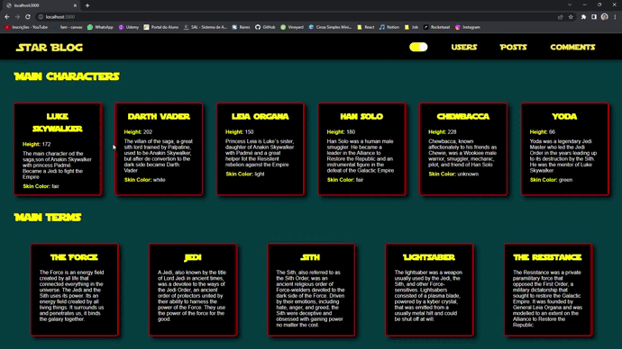

<h1>Star Blog</h1>
👨‍💻 Blog sobre o mundo de Star Wars.  
🧑🏽‍🦰 Foi desenvolvido com a API "SWAPI API" , disponivel em https://swapi.dev/documentation 
📕 Foi usadas duas outras API's para dados falsos: https://random-data-api.com/documentation e https://jsonplaceholder.typicode.com/ 
🪄 Informações paginaveis e filtraveis 
🤏🏽 Site totalmente responsivo.

<h2>Linguagens utilizadas:</h2>
    - NextJS  
    - Styled Components
    
<h2>Deskop mostrando a Home Page e tela de users</h2>  

<h2>Mobile mostrando as telas de posts e comments</h2>  

